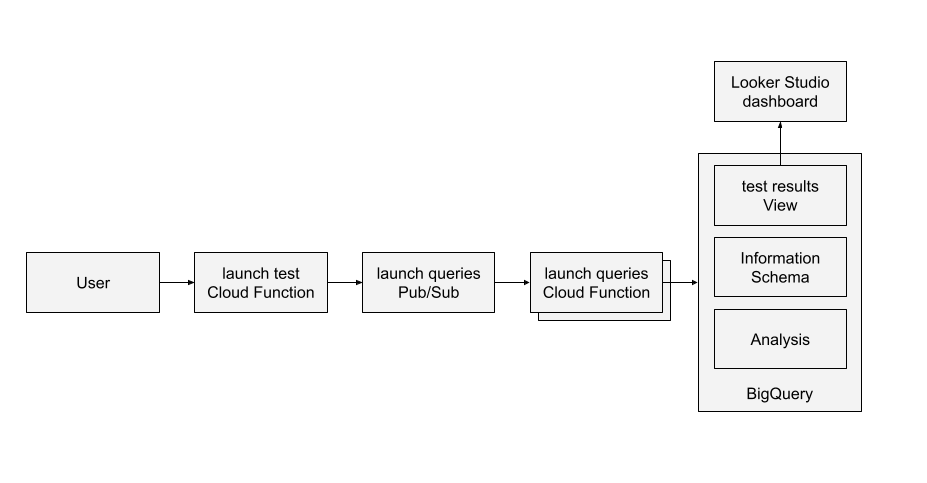

# Evaluating cost and performance of BigQuery workloads

This guide implements a serverless framework for measuring cost and performance of BigQuery workloads on three different scenarios: on-demand, slots autoscaling, and BI Engine working on top of an on-demand project. This project can be instrumental for quantifying cost of each of setup.

## Architecture
User launches a Cloud Function that launches a set of Cloud Functions that run against BigQuery. At any given time, the user can query the status of the test to get performance indicators. 



## Customization of your test
You can customize your tests by setting parameters as the number of query cycles, number of queries in each cycle, number of concurrent queries, and wait time between cycles. 

Additionally, you can test your own queries by adding them to the bucket referenced by the environment variable `QUERIES_BUCKET`.

Note that you can also add varibility to your queries by adding variables to the sql files in the bucket and to the Python dictionary in `cf_launch_queries/query_params.py` as lambda functions.

## Additional considerations:
Cloud Functions 1st gen are limited to 9 minutes.

## Steps:

1. Set Environment variables
1. Create admin project
1. Create project for running queries on-demand
1. Create project for queries in autoscaling
1. Create project for queries on BI Engine
1. Deploy Cloud Functions
1. Create the views in BigQuery
1. Launch the test
1. Create a Looker Studio report
1. Explore the data

### Step 1. Set Environment variables
``` shell
# Project ids.
BILLING_ACCOUNT_PROJECT=[PROJECT_ID_WITH_BILLING_ACCOUNT]
ADMIN_PROJECT=[YOUR_ADMIN_PROJECT_ID]
ONDEMAND_PROJECT=[YOUR_ON_DEMAND_PROJECT_ID]
AUTOSCALING_PROJECT=[YOUR_AUTOSCALING_PROJECT_ID]
BIENGINE_PROJECT=[YOUR_BI_ENGINE_PROJECT_ID]

# Region, bucket, and topic.
REGION='us-central1'
BQ_REGION='us'
QUERIES_BUCKET=[YOUR_QUERIES_BUCKET_NAME]
LAUNCH_QUERIES_TOPIC='launch_queries'

# Autoscaling and BI Engine.
AUTOSCALING_SLOTS=100
AUTOSCALING_RESERVATION_NAME=autoscaling_reservation
BIENGINE_RESERVATION_SIZE=50

# BigQuery resources for analyzing test results.
BQ_DATASET='bq_benchmarking'
BQ_MAPPING_TABLE='project_descriptions'
BQ_V_TEST_RESULTS='test_results'
```

### Step 2. Create an admin project
2.a. Create a project from which you will launch the tests.

``` shell
gcloud projects create ${ADMIN_PROJECT}
gcloud config set project ${ADMIN_PROJECT}
BILLING_ACCOUNT=$(gcloud beta billing projects describe ${BILLING_ACCOUNT_PROJECT} | awk '/billingAccountName: /{print $NF}')
gcloud beta billing projects link ${ADMIN_PROJECT} --billing-account=${BILLING_ACCOUNT}
```

2.b. Enable Cloud Functions and Pub/Sub APIs: 

``` shell 
gcloud services enable pubsub.googleapis.com cloudfunctions.googleapis.com bigqueryreservation.googleapis.com cloudbuild.googleapis.com
```

2.c. Create a bucket where you will host the queries and upload the queries.
``` shell
cd bq_benchmark/
gsutil mb -p ${ADMIN_PROJECT} -l ${REGION} gs://${QUERIES_BUCKET}
gsutil cp queries/* gs://${QUERIES_BUCKET}
```

### Step 3. Create project for running queries on-demand
Create a project where you will run queries on-demand. This can be the same as the management project.

``` shell
gcloud projects create ${ONDEMAND_PROJECT}
```

### Step 4. Create project for queries in autoscaling
4.a. Create a project where you will run queries with autoscaling.

``` shell
gcloud projects create ${AUTOSCALING_PROJECT}
```

4.b. In BigQuery, create a new reservation of type Autoscaling. See https://cloud.google.com/bigquery/docs/reservations-tasks#create_a_reservation_with_dedicated_slots

``` shell
bq mk \
    --project_id=${ADMIN_PROJECT} \
    --location=${BQ_REGION} \
    --reservation \
    --slots=0 \
    --ignore_idle_slots=true \
    --edition=STANDARD \
    --autoscale_max_slots=${AUTOSCALING_SLOTS} \
    ${AUTOSCALING_RESERVATION_NAME}
```

4.c. Assign the autoscaling project to the autoscaling reservation. See https://cloud.google.com/bigquery/docs/reservations-assignments#assign_my_prod_project_to_prod_reservation

``` shell
bq mk \
    --project_id=${ADMIN_PROJECT} \
    --location=${BQ_REGION} \
    --reservation_assignment \
    --reservation_id=${AUTOSCALING_RESERVATION_NAME} \
    --assignee_id=${AUTOSCALING_PROJECT} \
    --job_type=QUERY \
    --assignee_type=PROJECT
```

### Step 5. Create project for queries on BI Engine
5.a. Create a project where you will run queries on-demand together with BI Engine. We'll call this 'biengine_project'.

``` shell
gcloud projects create ${BIENGINE_PROJECT}
```

5.b. Enable APIs.

``` shell
gcloud services enable bigqueryreservation.googleapis.com --project ${BIENGINE_PROJECT}
```

5.c. Create a BI Engine reservation. See https://cloud.google.com/bigquery/docs/bi-engine-reserve-capacity#create_a_reservation

``` shell
bq --project_id=${BIENGINE_PROJECT} update \
    --bi_reservation_size=${BIENGINE_RESERVATION_SIZE} \
    --location=${BQ_REGION} \
    --reservation
```

### Step 6. Deploy Cloud Functions
6.a. Deploy the Cloud Function to launch the test. Depending on your organization policies, you may need to edit the policy constraints/cloudfunctions.allowedIngressSettings to "Allow All".

``` shell
gcloud functions deploy launch_test_http --runtime python310 \
--memory 4096MB \
--source ./cf_launch_test \
--trigger-http \
--set-env-vars ADMIN_PROJECT=${ADMIN_PROJECT},LAUNCH_QUERIES_TOPIC=${LAUNCH_QUERIES_TOPIC}
```

When prompting whether to allow unauthenticated invocations, answer "No".

6.b. Give permission to the Cloud Function to publish to Pub/Sub. 

6.c. Deploy the Cloud Function to execute queries.

``` shell
gcloud functions deploy launch_queries --runtime python310 \
--trigger-topic ${LAUNCH_QUERIES_TOPIC} --memory 4096MB \
--source ./cf_launch_queries 
```

6.d. Give permission to the Cloud Function to publish to query BigQuery and to list objects from Cloud Storage (Storage Object Viewer role).
6.e. Depending on your dataset, you may need to give the service account access to read the data. 
6.f. Give service account permission of JobUser to run queries in ONDEMAND_PROJECT, AUTOSCALING_PROJECT, and BIENGINE_PROJECT.

### Step 7. Create the views in BigQuery
7.a. Create BigQuery dataset

``` shell
bq --location=${BQ_REGION} mk \
    --dataset \
    ${ADMIN_PROJECT}:${BQ_DATASET}
```

7.b. Create the view

``` shell
. ./create_view.sh
```

### Step 8. Launch the test
You can edit the parameters of the test in the file.

``` shell
. ./launch_test.sh
```

### Step 9. Create a Looker Studio report
Clone this report: https://lookerstudio.google.com/reporting/aeb1d7a7-e5e3-4901-acf5-36a84c479777
Click the 3 dots in the top right and select "Make a copy"
Click "Copy Report"
Click "Resouce" menu then "Manage added data sources"
Click "Edit" under Actions title
Click "Edit connection"
Click on the project id or enter it manually
Click "bq_benchmarking" under Dataset title
Click "test_results" under Table title
Click "Reconnect"
Click "Apply" - there should be no field changes
Click "Done" - in top right
Click "Close" - in top right

### Step 10. Explore the data
In the Looker Studio report that you can crated you can now compare the cost and performance of running your workloads in different setups.